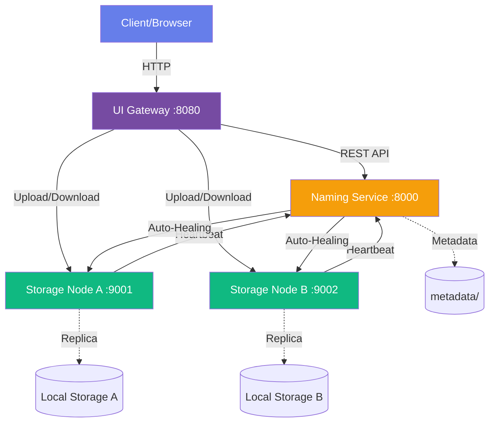
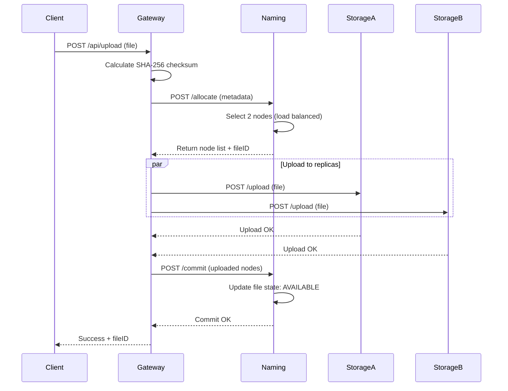
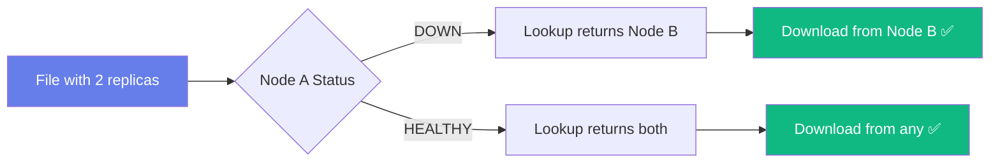

# 🗄️ Distributed File Storage System

<div align="center">


**A robust distributed file storage system with automatic replication, auto-healing, and real-time monitoring**

[Features](#-features) • [Architecture](#-architecture) • [Quick Start](#-quick-start) • [API Docs](./API_DOCS.md) • [Dashboard](#-admin-dashboard)

</div>

---

## 📋 Overview

Sistem penyimpanan file terdistribusi yang menerapkan replikasi otomatis untuk menjaga konsistensi data antar banyak node penyimpanan. Sistem ini tetap berfungsi meskipun salah satu node gagal (fault-tolerant) dengan mekanisme auto-healing yang otomatis memperbaiki replika yang hilang.

### 🎯 Key Features

- ✅ **Automatic Replication** - File otomatis direplikasi ke 2+ storage nodes
- ✅ **Auto-Healing** - Sistem otomatis membuat replika baru jika terdeteksi kehilangan
- ✅ **Fault Tolerance** - Tetap operational walau 1 node down
- ✅ **Load Balancing** - Smart replica placement berdasarkan kapasitas node
- ✅ **Health Monitoring** - Real-time node health tracking (HEALTHY/SUSPECT/DOWN)
- ✅ **Admin Dashboard** - Web UI untuk monitoring dan management
- ✅ **Checksum Verification** - SHA-256 untuk memastikan integritas file
- ✅ **RESTful API** - Komunikasi antar service menggunakan REST API

---

## 🏗️ Architecture



### Components

| Component | Port | Responsibility |
|-----------|------|----------------|
| **Naming Service** | 8000 | Metadata management, node registry, auto-healing, file allocation |
| **Storage Node(s)** | 9001+ | File storage, replication, health reporting |
| **UI Gateway** | 8080 | User interface, API gateway, proxy untuk upload/download |

---

## 🚀 Quick Start

### Prerequisites

- Go 1.19+ installed
- Minimal 2 terminal windows

### 1️⃣ Start Naming Service

```bash
cd naming_service
go run main.go
```

Output:
```
Naming Service running at :8000 ...
Auto-healing background job started
```

### 2️⃣ Start Storage Nodes

**Node A:**
```bash
cd storage_node
NODE_ID=node-a PORT=9001 DATA_DIR=./data_a go run main.go
```

**Node B (terminal baru):**
```bash
cd storage_node
NODE_ID=node-b PORT=9002 DATA_DIR=./data_b go run main.go
```

Output per node:
```
Storage Node node-a at :9001 (data=./data_a)
```

### 3️⃣ Start UI Gateway

```bash
cd ui_gateway
go run main.go
```

Output:
```
UI Gateway running at :8080 (NAMING_URL=http://localhost:8000)
```

### 4️⃣ Access Dashboard

Buka browser:
- **Dashboard**: http://localhost:8080/dashboard
- **Simple UI**: http://localhost:8080/

---

## 💻 Admin Dashboard

Dashboard menyediakan:

- 📊 **Real-time Metrics** - Total files, nodes, storage usage
- 📤 **File Upload** - Drag & drop atau click to upload
- 📂 **File Browser** - List semua files dengan status replikasi
- 💾 **Node Monitor** - Health status, capacity, load factor
- 🗑️ **File Management** - Delete files via UI
- 🔄 **Auto-refresh** - Update setiap 5 detik


---

## 📊 File Upload Flow



---

## 🔄 Auto-Healing Mechanism

Auto-healing berjalan setiap **30 detik** untuk memeriksa:

1. ✅ **Replica Count** - Apakah setiap file memiliki ≥2 replicas yang healthy
2. ✅ **Node Health** - Apakah node masih HEALTHY (heartbeat <20s)
3. ✅ **Replica Status** - Apakah replica dalam state READY

**Jika terdeteksi replica < 2:**
- Sistem mencari candidate nodes (healthy, cukup space, belum host file)
- Membuat replica entry baru dengan status MISSING
- File state berubah ke DEGRADED
- Log healing activity

**Example Log:**
```
[AUTO-HEAL] File abc123 (document.pdf) has only 1 healthy replicas, need 2
[AUTO-HEAL] Added replica candidate: node-c for file abc123
```

---

## 🛡️ Fault Tolerance

### Scenario: 1 Node Down



**Sistem tetap functional:**
- ✅ Download masih bisa dari replica healthy
- ✅ Auto-healing akan membuat replica baru dalam 30-60s
- ✅ Dashboard menunjukkan status DEGRADED

---

## 📡 API Endpoints

### Naming Service (`:8000`)

| Method | Endpoint | Description |
|--------|----------|-------------|
| POST | `/register-node` | Register storage node |
| POST | `/heartbeat` | Node health check |
| POST | `/allocate` | Allocate file & get nodes |
| POST | `/commit` | Commit upload result |
| GET | `/lookup/{fileId}` | Get file locations |
| GET | `/metrics` | System metrics |
| GET | `/list-files` | List all files |
| GET | `/list-nodes` | List all nodes |
| POST | `/delete-file` | Soft delete file |

### Storage Node (`:9001`, `:9002`, ...)

| Method | Endpoint | Description |
|--------|----------|-------------|
| POST | `/upload` | Upload file to node |
| GET | `/download/{fileId}` | Download file |
| GET | `/has?fileId=...` | Check file exists |
| GET | `/health` | Node health & metrics |
| GET | `/list` | List files on node |
| POST | `/verify` | Verify file checksum |

### UI Gateway (`:8080`)

| Method | Endpoint | Description |
|--------|----------|-------------|
| GET | `/` | Simple upload UI |
| GET | `/dashboard` | Admin dashboard |
| POST | `/api/upload` | Upload file (multipart) |
| GET | `/api/files` | List all files |
| GET | `/api/nodes` | List all nodes |
| GET | `/api/metrics` | System metrics |
| POST | `/api/delete` | Delete file |
| GET | `/api/download` | Proxy download |

### 📚 Detailed API Documentation

See [API_DOCS.md](./API_DOCS.md) for complete API reference with request/response examples.

---

## 🧪 Testing

### Basic Upload/Download Test

```bash
# Upload file
curl -F "file=@test.txt" -F "filename=test.txt" http://localhost:8080/api/upload

# Response:
# {
#   "fileId": "abc123...",
#   "filename": "test.txt",
#   "size": 1024,
#   "checksum": "sha256:...",
#   "uploaded": ["node-a", "node-b"]
# }

# List files
curl http://localhost:8080/api/files

# Download file (replace {nodeUrl} and {fileId})
curl "http://localhost:8080/api/download?fileId=abc123&nodeUrl=http://localhost:9001"
```

### Failure Simulation Test

```bash
# 1. Upload file
curl -F "file=@test.txt" -F "filename=test.txt" http://localhost:8080/api/upload

# 2. Stop node B (Ctrl+C di terminal node-b)

# 3. Check metrics (should show 1 node down)
curl http://localhost:8080/api/metrics

# 4. File masih bisa didownload dari node A
curl "http://localhost:8080/api/download?fileId={fileId}&nodeUrl=http://localhost:9001"

# 5. Restart node B
NODE_ID=node-b PORT=9002 DATA_DIR=./data_b go run main.go

# 6. Node B akan auto-register dan heartbeat kembali
```

---

## 📁 Project Structure

```
ProjectAkhir_Sister/
├── naming_service/
│   ├── main.go              # Naming service + auto-healing
│   └── metadata/            # Persisted metadata (JSON)
│       ├── files.json
│       └── nodes.json
├── storage_node/
│   ├── main.go              # Storage node service
│   ├── data_a/              # Node A storage
│   └── data_b/              # Node B storage
├── ui_gateway/
│   ├── main.go              # UI Gateway API
│   ├── index.html           # Simple upload UI
│   └── dashboard.html       # Admin dashboard
├── README.md                # This file
├── ARCHITECTURE.md          # Detailed architecture
├── API_DOCS.md              # API documentation
└── TESTING.md               # Testing scenarios
```

---

## 🔧 Configuration

### Environment Variables

**Naming Service:**
```bash
# Default: :8000
ADDR=:8000
```

**Storage Node:**
```bash
NODE_ID=node-a                          # Node identifier
PORT=9001                               # HTTP port
DATA_DIR=./data_a                       # Storage directory
NAMING_URL=http://localhost:8000        # Naming service URL
CAPACITY_BYTES=1073741824              # Capacity (1GB)
```

**UI Gateway:**
```bash
ADDR=:8080                              # HTTP port
NAMING_URL=http://localhost:8000        # Naming service URL
```

---

## 🎓 Technical Details

### Metadata Schema

```json
{
  "fileId": "uuid-like-string",
  "filename": "document.pdf",
  "size": 1048576,
  "checksum": "sha256:...",
  "contentType": "application/pdf",
  "version": 1,
  "state": "AVAILABLE",
  "replicas": [
    {
      "nodeId": "node-a",
      "url": "http://localhost:9001",
      "status": "READY",
      "lastVerifiedAt": "2025-12-04T00:00:00Z"
    },
    {
      "nodeId": "node-b",
      "url": "http://localhost:9002",
      "status": "READY",
      "lastVerifiedAt": "2025-12-04T00:00:00Z"
    }
  ],
  "createdAt": "2025-12-04T00:00:00Z",
  "updatedAt": "2025-12-04T00:00:00Z"
}
```

### File States

| State | Description |
|-------|-------------|
| `ALLOCATED` | File metadata created, belum ada upload |
| `PARTIAL` | Beberapa replicas uploaded (< replication factor) |
| `AVAILABLE` | Semua replicas healthy dan ready |
| `DEGRADED` | File available tapi replica count < target |
| `DELETED` | Soft deleted |

### Node Status

| Status | Condition |
|--------|-----------|
| `HEALTHY` | Last heartbeat < 10s ago |
| `SUSPECT` | Last heartbeat 10-20s ago |
| `DOWN` | Last heartbeat > 20s ago |

---

## 🚀 Production Considerations

Untuk deployment production, pertimbangkan:

- 🔒 **Authentication** - Tambahkan API key atau OAuth
- 🔐 **HTTPS** - Gunakan TLS untuk semua komunikasi
- 💾 **Database** - Ganti JSON storage dengan PostgreSQL/MongoDB
- 📊 **Monitoring** - Integrate dengan Prometheus/Grafana
- 🔄 **Backup** - Automated backup untuk metadata
- ⚖️ **Load Balancer** - Nginx/HAProxy di depan UI Gateway
- 🌍 **Multi-region** - Deploy nodes di multiple zones

---

## 🤝 Contributing

Contributions are welcome! Areas for improvement:

- [ ] Actual file copying untuk auto-healing (saat ini hanya metadata)
- [ ] Compression untuk file storage
- [ ] File versioning support
- [ ] Access control lists (ACL)
- [ ] Bandwidth throttling
- [ ] Metrics export untuk Prometheus

---

## 📄 License

This project is for educational purposes (Project Akhir Sistem Terdistribusi).

---

## 👨‍💻 Author

Created with ❤️ for Distributed Systems Course

**Tech Stack:** Go • REST API • Vanilla HTML/CSS/JS

---

<div align="center">

**[⬆ Back to Top](#-distributed-file-storage-system)**

Made with 🗄️ by Distributed Systems Team

</div>
